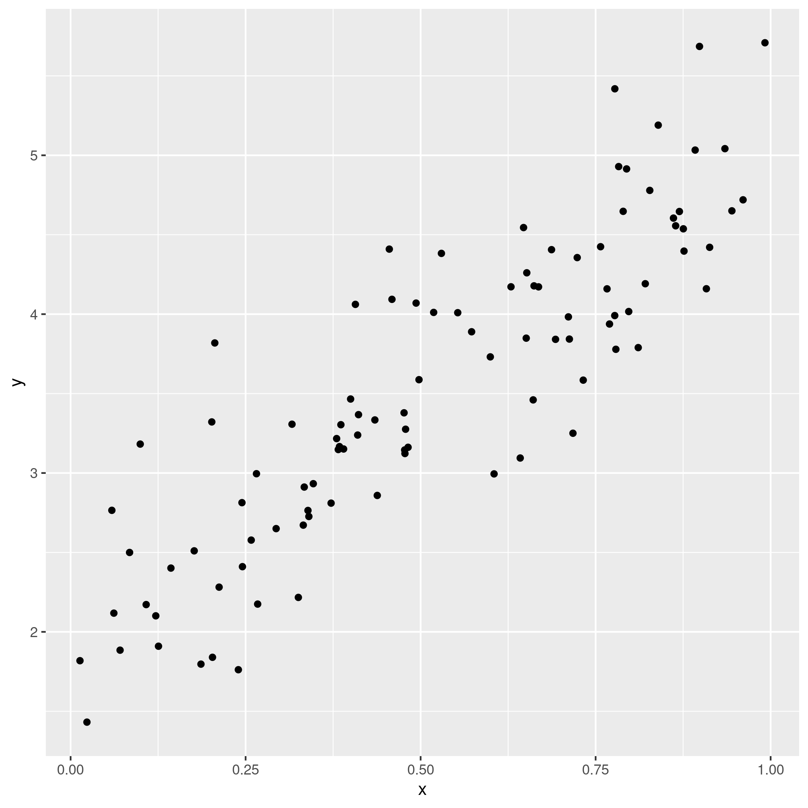
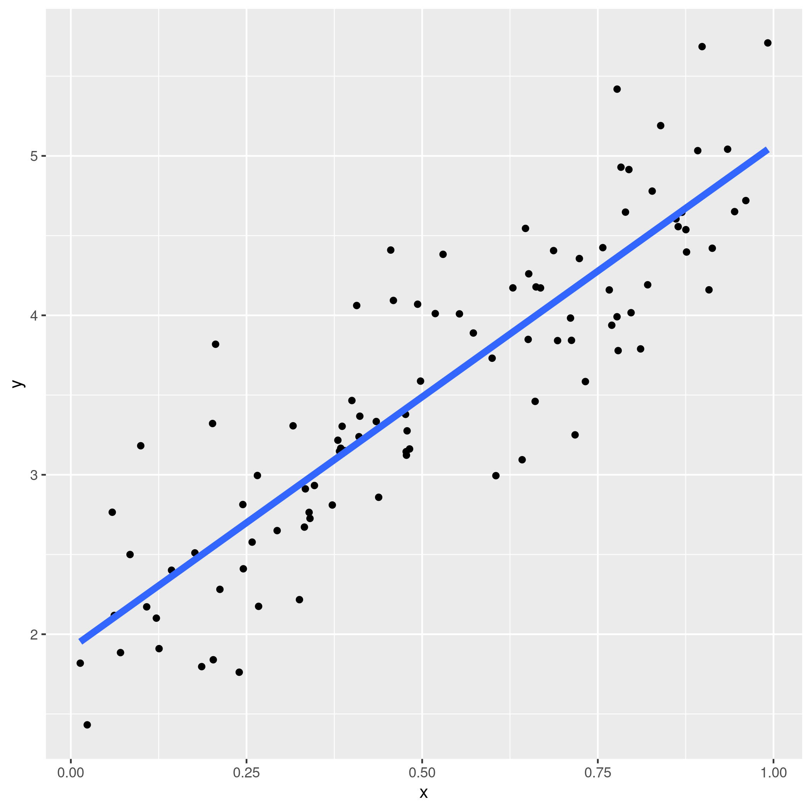
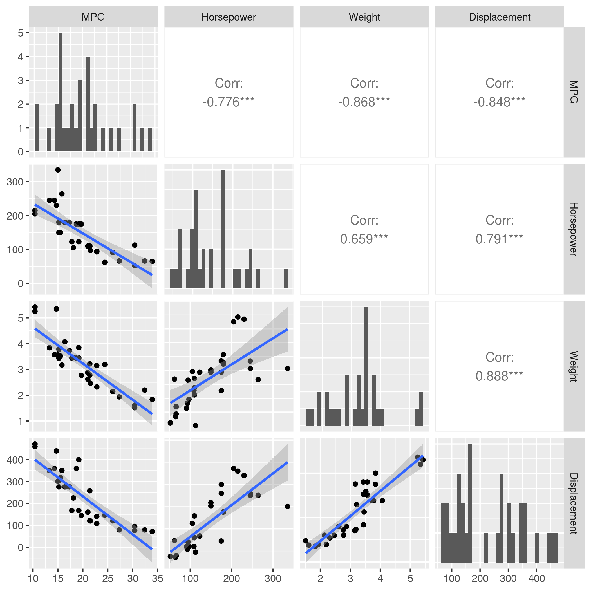
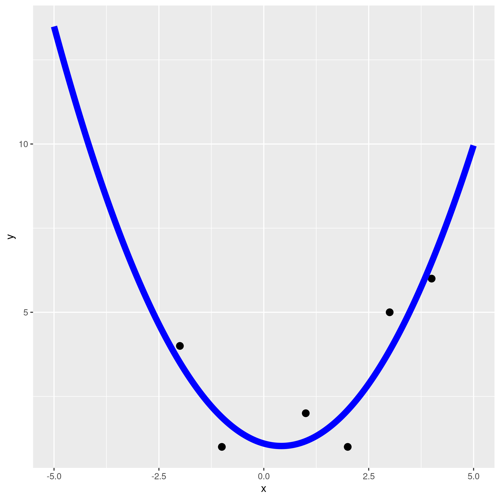

# Overview

Difficulties in understanding why we use QR-decompositions to find linear least squares could arise either because the mathematics is poorly motivated (why would we choose this method?) or because the actual mechanics of the calculation are mysterious (how would we do it this way?). Below, I try to address both sets of issues.

We'll look at:

1. Why we would want to do linear least squares.
2. How to set up the least squares problem as an optimization problem.
3. How to solve this problem analytically.
4. Why numerical issues motivate us to use QR to solve the problem.
5. How to calculate QR.
6. How to use QR.

# Why Are We Doing This?

**tl;dr To make a predictive model from some data.**

Imagine that we have a set of data defined by $(x,y)$ values. These $(x,y)$ values make a scatterplot. We would like to developed a mathematical model of this data so that for _any_ $x$ value we can predict the corresponding $y$ value. You might say that we are searching for a function $f(x)$ that predicts $y$ well.

Graphically, we want to go from this:



to this:



We would like $f(x)$ to be a simple model (we'll discuss more complicated models below) so that it is easy to interpret and fast to evaluate. Therefore, we choose a line. Thus, our model has the form $f(x)=a*x+b$.

If we choose $a$ and $b$ well, we will have a line that is a good fit to our data.

# What Are Our Fitting Options?

But what is a good fit? Why is the green line below a better choice than the orange and blue lines?


There are many different ways to define what a good fit is, but probably all of them involve the distances between the points and the fit line. Pretend we have already chosen a value for $a$ and a value for $b$. Together, these define a line. Now, for each point in the dataset, we can measure its distance to the line. There are different ways we can do this. We could measure the vertical, horizontal, or shortest-path distance between the fit line and the data point, like so:


The offsets shown in (a) are called _perpendicular offsets_. These offsets are useful in situations where the $x$ values of our data have an uncertainty/error component. [Total least squares](https://en.wikipedia.org/wiki/Total_least_squares) is used to find this fit line.

The offsets shown in (c) are horizontal. We will never concern ourselves with this situation mathematically because we can flip the axes on (c) to get (b).

The offsets shown in (b) are the vertical offsets we'll be discussing at length here. These are useful in situations where the uncertainty in our $x$ values is much less than the uncertainty in our $y$ values. We can find the best fit line to this using [linear least squares](https://en.wikipedia.org/wiki/Linear_least_squares). LLS is a generalization of [ordinary least squares](https://en.wikipedia.org/wiki/Ordinary_least_squares), which assumes all $y$ have the same uncertainty, and also includes [weighted least squares](https://en.wikipedia.org/wiki/Weighted_least_squares) (in which each $y$ may have different uncertainty) and [generalized least squares](https://en.wikipedia.org/wiki/Generalized_least_squares) (which is used when the residuals of a model have correlations).

Today, we'll assume all of our $y$ have the same uncertainty and will find the best-fit line using **ordinary least squares**.

Pedagogically, we'll also do this because the math has nice analytic forms and relative easy explanations. Much later, you'll forget that all these other options existed and spend the rest of your life developing sub-standard models, but that's another story.

# Choosing An Error Function

The foregoing means that for a given point $i$ with coordinates $(x,y)$ and a model $f(x)$ the error of that point with respect to the model is $e_i=g(f(x_i),y_i)$ where $g(\cdot)$ is some function. The total error is the sum of all of these errors: $\sum_i e_i$.

How can we choose an appropriate $g(\cdot)$?

Since we're summing $g(\cdot)$ across many inputs, it's clear that it should always be positive, otherwise the error of one point would cancel another. So $g(\cdot)$ needs to map the range $(-\infty,\infty)$ to the range $[0, \infty)$. A couple of obvious functions that do this are the square function and the absolute value function. We will prefer the square function because:

* It has nice derivatives, allowing for easy mathematical analysis.
* It implies that the uncertainties in the $y$ terms are normally distributed.
* If we assume that our $y$ datapoints are independent and normal distributed, the least squares method using a squared error term is the result of [maximum likelihood](https://en.wikipedia.org/wiki/Maximum_likelihood_estimation).
* It penalizes points farther from the line more than points closer to the line, which has a certain karmic justice about it.

So, for a point $(x,y)$ and a model $f(x)$ the error of that point with respect ot the model is $e_i=(f(x_i)-y_i)^2$. The total error is still $\sum_i e_i$.

Regardless of which error we choose, if we search all possible combinations of values of `a` and `b` and choose the one with the smallest sum of errors, we call this the best-fitting model. It is the model that minimizes the squared error or, in other words, the least-squares fit.

If we were using total least squares with perpendicular errors, examining all the models might look like this, except that we'd also have to search all the possible offsets of the line:


# Heading for Higher Dimensions

Now, for our $(x,y)$ points above $x$ might have represented the horsepower of a car while $y$ represented miles per gallon (MPG). But maybe horsepower alone might be a poor indicator of MPG, so we would like to use more data. Maybe using Horsepower, Weight, and Displacement together could give us a better model for predicting MPG.



So, we make a matrix $X$. Each row of $X$ is some data we know about a car: it's horsepower, weight, and displacement. A vector `y` still contains the MPG.

If we want a simple model to predict MPG, our simplest model still looks like a line, $f(X) = X\beta+b$, except that $\beta$ and $b$ are vectors.

Our error is still $f(X)-y=X\beta+b-y$. But note that we can simplify this equation! If we add a column of 1 to the left-hand side of $X$ and an additional entry to $\beta$, to get the vector $<\beta_\textrm{new}, \beta_1, \beta_2, \beta_3, \ldots>$ then $X\beta+b$ with this modified $X$ and new $\beta$ automagically includes the `+b` offset from $X\beta+b-y$. That is, we've made this change:
$$
\begin{bmatrix}
X_{1,1} & X_{1,2} & X_{1,3} \\
X_{2,1} & X_{2,2} & X_{2,3} \\
X_{3,1} & X_{3,2} & X_{3,3}
\end{bmatrix}
\begin{bmatrix}
\beta_1 \\ \beta_2 \\ \beta_3
\end{bmatrix}
\rightarrow
\begin{bmatrix}
1 & X_{1,1} & X_{1,2} & X_{1,3} \\
1 & X_{2,1} & X_{2,2} & X_{2,3} \\
1 & X_{3,1} & X_{3,2} & X_{3,3}
\end{bmatrix}
\begin{bmatrix}
\beta_0 \\ \beta_1 \\ \beta_2 \\ \beta_3
\end{bmatrix}
$$

Thus, we can write the error in a simpler form as $X\beta-y$. This returns a vector. The sum of squares is the dot product of this vector with itself: $(X\beta-y)^T(X\beta-y)$. So minimizing this gives the best-fit line in the least-squares sense.

# Developing An Optimization Problem

So how do we get $\beta$? Since everything in math is better if we're solving for $x$ let's rewrite our equation $X\beta-y$ above as $Ax-b$.

Formally, the problem we wish to solve is
$$
\textrm{argmin}_x \lVert Ax-b \rVert_2
$$

Note that any minimizer of the 2-norm is also a minimizer of the square of the 2-norm, so finding a solution to $\lVert Ax-b\rVert_2^2=(Ax-b)^T(Ax-b)$ also solves the problem, as discussed above.

We can find an analytical solution to this!

First, expand:
$$
(Ax-b)^T(Ax-b) = x^TA^T A x -x^TA^Tb -b^TAx + b^Tb
$$
Since $x^TA^Tb$ gives a scalar, swapping the transposes doesn't affect its shape, so we get
$$
x^TA^T A x -2b^TAx + b^Tb
$$
From matrix calculus we know that:
$$
\begin{aligned}
\nabla_x(x^TA^Tb) &= A^Tb \\
\nabla_x(x^TA^TAx) &= 2A^TAx \\
\nabla_x(b^T b) &= 0
\end{aligned}
$$
Setting the derivative equal to zero and solving gives:
$$
\begin{aligned}
0&=2A^TAx - 2A^Tb \\
A^TAx&=A^Tb \\
\end{aligned}
$$
This is called the [normal equation](https://mathworld.wolfram.com/NormalEquation.html).

# Why the normal equation won't do

We can solve the normal equation with some simple matrix algebra to get:
$$
x=(A^TA)^{-1}A^Tb
$$
(Note that $(A^TA)^{-1}A^T$ is the [Moore-Penrose inverse](https://en.wikipedia.org/wiki/Moore%E2%80%93Penrose_inverse).)

Unfortunately, it is a rule in numerical linear algebra that we never want to calculate the inverse of any matrix if we can possibly avoid it because:

* Although $A$ might be sparse, $A^{-1}$ is rarely so. For large matrices this means that taking $A^{-1}$ can cause your computer to run out of memory.
* The inverse is used often mathematically to solve the equation $Ax=b$, but in practice computing $A^{-1}$ is slower than solving the equation $Ax=b$ using other methods we'll discuss below.
* You might think that if you are solving $Ax=b$ for many values of $b$ then finding $A^{-1}$ only once would save time, but when we solve $Ax=b$ we will factor $A$ in a way we can reuse.
* Finding and using $A^{-1}$ often results in answers that are not as exact as they could be. Remember, computers use [floating-point arithmetic](https://en.wikipedia.org/wiki/Floating-point_arithmetic) so they are susceptible to numerical error. (The many reasons why are explained in the classic, but lengthy, article [What every computer scientist should know about floating-point arithmetic](https://doi.org/10.1145/103162.103163).) These articles show some numerics: [1](https://collinerickson.github.io/2018/04/16/don-t-invert-that-matrix-in-r/), [2](https://www.r-bloggers.com/2015/07/dont-invert-that-matrix-why-and-how/).

Therefore, we would like a way of finding `x` that doesn't use inverses.

# Solving Without Inverses

There is a beautiful thing called a [QR-decomposition](https://en.wikipedia.org/wiki/QR_decomposition) in the world.

It takes a matrix $A$ and builds two matrices $Q$ and $R$ such that $A=QR$. These matrices have special properties:

* $Q$ is an [orthogonal matrix](https://en.wikipedia.org/wiki/Orthogonal_matrix)
* $R$ is an [upper-traingular matrix](https://en.wikipedia.org/wiki/Triangular_matrix)

From above, we know that the equation we need to solve is:
$$
A^T A x = A^Tb
$$
If we plug $A=QR$ into this equation we get:

$$
\begin{aligned}
A^T A x &= A^Tb \\
(QR)^T (QR) x &= (QR)^T b \\
R^T Q^T QR x &= R^T Q^T b
\end{aligned}
$$

Since Q is orthogonal, we know that $Q^T Q = I$, so...
$$
\begin{aligned}
R^T Q^T QR x &= R^T Q^T b \\
R^T R x &= R^T Q^T b  \\
R x &= Q^T b
\end{aligned}
$$
$Q^Tb$ is just a vector $v$ so we have
$$
Rx=v
$$
But, since $R$ is upper-triangular we can easily solve this equation by using [back substitution](https://en.wikipedia.org/wiki/Triangular_matrix#Forward_and_back_substitution).

So, we now have a nice way of solving the least squares problem without taking an inverse!

# Some Clarifications

**Finding the QR-decomposition.** A QR-decomposition is any procedure that gives you a $QR$ for a matrix $A$. The textbook approach to this is the [Gram-Schmidt](https://en.wikipedia.org/wiki/Gram%E2%80%93Schmidt_process) algorithm. In practice, Gram-Schmidt is [not numerically stable](https://math.stackexchange.com/a/3957623/14493) enough so no computer software uses it. Instead, techniques like [Householder reflections](https://en.wikipedia.org/wiki/QR_decomposition#Using_Householder_reflections) are used.

**It is not the QR algorithm!** Folks who are sloppy with their language may refer to finding a QR-decomposition as "the QR algorithm". This is bad. The [actual QR algorithm](https://en.wikipedia.org/wiki/QR_algorithm) is used to find the eigenvalues of a matrix. Folks should say "Gram-Schmidt" algorithm instead.

# The Gram-Schmidt Process

We will use the Gram-Schmidt Process to find the QR-decomposition of our matrix $A$.

To do so, we represent the columns of $A$ as $a_i$:
$$
A =
\left[
\begin{array}{c|c|c|c}
a_1 & a_2 & \ldots & a_n
\end{array}
\right]
$$
The Gram-Schmidt process then finds a series of vectors by subtracting successively subtrating [projections](https://en.wikipedia.org/wiki/Vector_projection) of the columns of $A$ from each other.

If we define the [projection operator](https://en.wikipedia.org/wiki/Vector_projection) of two vectors $u,v$ as:
$$
\textrm{proj}_u(v) = \frac{u\cdot v}{u \cdot u} u
$$
then Gram-Schmidt looks like:
$$
\begin{aligned}
u_1&=a_1, & e_1&=\frac{u_1}{\lVert u_1 \rVert} \\
u_2&=a_2 - \textrm{proj}_{u_1}(a_2), & e_2&=\frac{u_2}{\lVert u_2 \rVert}\\
u_3&=a_3 - \textrm{proj}_{u_1}(a_3) - \textrm{proj}_{u_2}(a_3), & e_3&=\frac{u_3}{\lVert u_3 \rVert}\\
u_k&=a_k - \textrm{proj}_{u_1}(a_k) - \ldots - \textrm{proj}_{u_{k-1}}(a_k), & e_k&=\frac{u_k}{\lVert u_k \rVert}
\end{aligned}
$$
If we use the $e$ vectors to our advantage, we can rewrite this as:
$$
\begin{aligned}
u_1&=a_1, & e_1&=\frac{u_1}{\lVert u_1 \rVert} \\
u_2&=a_2 - (a_2 \cdot e_1)e_1, & e_2&=\frac{u_2}{\lVert u_2 \rVert}\\
u_3&=a_3 - (a_3 \cdot e_1)e_1 - (a_3\cdot e_2)e_2, & e_3&=\frac{u_3}{\lVert u_3 \rVert}\\
u_k&=a_k - (a_k \cdot e_1)e_1 - \ldots - (a_k\cdot e_{k-1})e_{k-1}, & e_k&=\frac{u_k}{\lVert u_k \rVert}
\end{aligned}
$$
Our QR factorization $Q=AR$ is then:
$$
A =
\left[
\begin{array}{c|c|c|c}
a_1 & a_2 & \ldots & a_n
\end{array}
\right]
=
\left[
\begin{array}{c|c|c|c}
e_1 & e_2 & \ldots & e_n
\end{array}
\right]
\begin{bmatrix}
a_1 \cdot e_1 & a_2\cdot e_1 & \ldots & a_n \cdot e_1 \\
0             & a_2\cdot e_2 & \ldots & a_n \cdot e_2 \\
\vdots        & \vdots       & \ddots &        \vdots \\
0             & 0            & \ldots & a_n \cdot e_n \\
\end{bmatrix}
$$

Note that QR-decompositions are **only unique up to their sign**. Meaning that
$$A=QR=(-Q)(-R)$$
therefore, you should not be surprised if different algorithms give you matrices that are the negative of the ones you find.

# Quadratic Fitting Example

Now, imagine we have the matrix the following 2D data:
```
 x  y
-2  4
-1  1
 1  2
 2  1
 3  5
 4  6
```
We'll start off by doing some [exploratory data analysis (EDA)](https://en.wikipedia.org/wiki/Exploratory_data_analysis) because we don't want to miss any [gorillas in our dataset](https://doi.org/10.1186/s13059-020-02133-w). We'll do this by plotting it:


The data goes down and back up again, so it's plausible to thing that a quadratic polynomial is a good fit for this small dataset. That polynomial is given by:
$$
P(x) = \beta_0 + \beta_1 x + \beta_2 x^2
$$
We have several points, so we have the system of equations:
$$
\begin{aligned}
P(x_1) &= y_1 &= \beta_0 + \beta_1 x_1 + \beta_2 {x_1}^2 \\
P(x_2) &= y_2 &= \beta_0 + \beta_1 x_2 + \beta_2 {x_2}^2 \\
\vdots &= \vdots &= \vdots \\
P(x_n) &= y_n &= \beta_0 + \beta_1 x_n + \beta_2 {x_n}^2 \\
\end{aligned}
$$
We can write this in matrix form as:
$$
\begin{bmatrix}
1 & x_1 & {x_1}^2 \\
1 & x_2 & {x_2}^2 \\
\vdots & \vdots & \vdots \\
1 & x_n & {x_n}^2
\end{bmatrix}
\begin{bmatrix}
\beta_0 \\ \beta_1 \\ \beta_2
\end{bmatrix}
=
\begin{bmatrix}
P(x_1) \\
P(x_2) \\
\vdots \\
P(x_n) \\
\end{bmatrix}
$$
This has exactly the form of the matrices above, so we can find a least-squares fit using a QR-decomposition! Note that the matrix on the left-hand side of the equation above is the [Vandermonde matrix](https://en.wikipedia.org/wiki/Vandermonde_matrix).

For our numerical problem we have the matrix $A$:
```
1 -2  4
1 -1  1
1  1  1
1  2  4
1  3  9
1  4 16
```
Let's run Gram-Schmidt on it by hand:
```
u1 = A_1 = [1,1,1,1,1,1]

e1 = u1 / || u1 ||
   = [1,1,1,1,1,1] / || [1,1,1,1,1,1] ||
   = [1,1,1,1,1,1] / √6

u2 = a2 - (a2 · e1)e1
   = [-2,-1,1,2,3,4] - ([-2,-1,1,2,3,4] · [1,1,1,1,1,1] / √6) [1,1,1,1,1,1] / √6
   = [-2,-1,1,2,3,4] - 2.857738033247042 * [1,1,1,1,1,1] / √6
   = [-2,-1,1,2,3,4] - [1.166, 1.166, 1.166, 1.166, 1.166, 1.166]
   = [-3.166, -2.166, -0.166, 0.833, 1.833, 2.833]

e2 = u2 / || u2 ||
   = [-3.166, -2.166, -0.166, 0.833, 1.833, 2.833] / || [-3.166, -2.166, -0.166, 0.833, 1.833, 2.833] ||
   = [-3.166, -2.166, -0.166, 0.833, 1.833, 2.833] / 5.180090089306685
   = [-0.611, -0.418, -0.0321, 0.1608, 0.3539, 0.54696]

u3 = a3 - (a3 · e1)e1 - (a3 · e2)e2
   = [4,1,1,4,9,16]
     - ([4,1,1,4,9,16] · [1,1,1,1,1,1] / √6) [1,1,1,1,1,1] / √6
     - ([4,1,1,4,9,16] · [-0.611, -0.418, -0.0321, 0.1608, 0.3539, 0.54696]) [-0.611, -0.418, -0.0321, 0.1608, 0.3539, 0.54696]
   = [4,1,1,4,9,16]
     - 14.288690166235206 * [1,1,1,1,1,1] / √6
     - 9.68451625392119 * [-0.611, -0.418, -0.0321, 0.1608, 0.3539, 0.54696]
   = [4,1,1,4,9,16]
     - [5.83, 5.83, 5.83, 5.83, 5.83, 5.83]
     - [-5.92, -4.05, -0.31, 1.56, 3.43, 5.30]
   = [4.09, -0.78, -4.52, -3.39, -0.26, 4.87]

e3 = u3 / || u3 ||
   = [4.09, -0.78, -4.52, -3.39, -0.26, 4.87] / || [4.09, -0.78, -4.52, -3.39, -0.26, 4.87] ||
   = [4.09, -0.78, -4.52, -3.39, -0.26, 4.87] / 8.546547739343035
   = [0.478, -0.092, -0.529, -0.396, -0.031, 0.5697]
```
This gives us a Q matrix of
```
Q = [e1, e2, e2]
  = |-0.40824829 -0.61131498  0.47819969|
    |-0.40824829 -0.41826814 -0.09157015|
    |-0.40824829 -0.03217447 -0.529072  |
    |-0.40824829  0.16087236 -0.396804  |
    |-0.40824829  0.3539192  -0.03052338|
    |-0.40824829  0.54696603  0.56976985|
```

We can double-check this in code using Python:

```python
import numpy as np

data = [-2,-1,1,2,3,4]
y = [4,1,2,1,5,6]

A = np.vander(data, N=3)
A = np.fliplr(A)

Q, R = np.linalg.qr(A)

x_from_qr = np.linalg.solve(R, Q.T@y)

x_from_lstsq, residuals, rank, singular_valeus = np.linalg.lstsq(A,y)

diff=np.linalg.norm(x_from_qr-x_from_lstsq)
```
This gives
```text
>>> Q
array([[-0.40824829, -0.61131498,  0.47819969],
       [-0.40824829, -0.41826814, -0.09157015],
       [-0.40824829, -0.03217447, -0.529072  ],
       [-0.40824829,  0.16087236, -0.396804  ],
       [-0.40824829,  0.3539192 , -0.03052338],
       [-0.40824829,  0.54696603,  0.56976985]])
>>> R
array([[ -2.44948974,  -2.85773803, -14.28869017],
       [  0.        ,   5.18009009,   9.68451625],
       [  0.        ,   0.        ,   8.54654774]])
>>> x_from_qr
array([ 1.1       , -0.35357143,  0.425     ])
>>> x_from_lstsq
array([ 1.1       , -0.35357143,  0.425     ])
>>> diff
1.1564453092915794e-15
```
If we take these coefficients and plug them into the equation:
$$
P(x) = \beta_0 + \beta_1 x + \beta_2 x^2
$$
we get
$$
P(x) = 1.1 + -0.35357143*x + 0.425*x^2
$$

Plotting this against the original data gives us:

